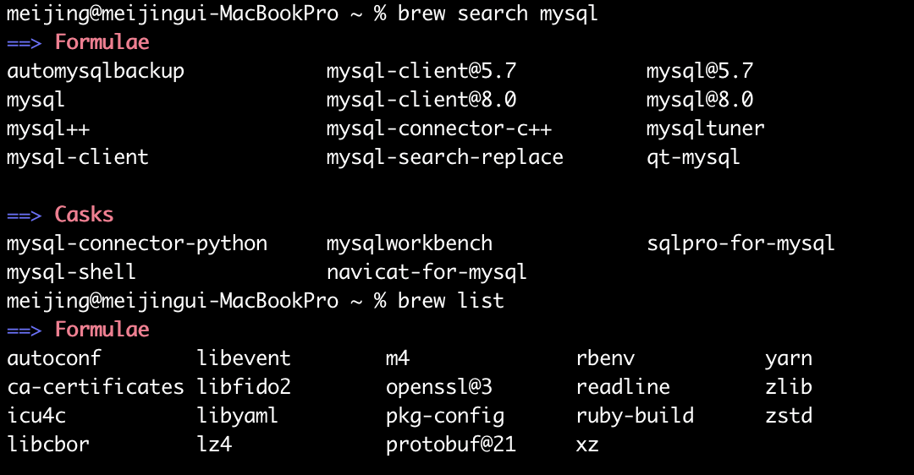
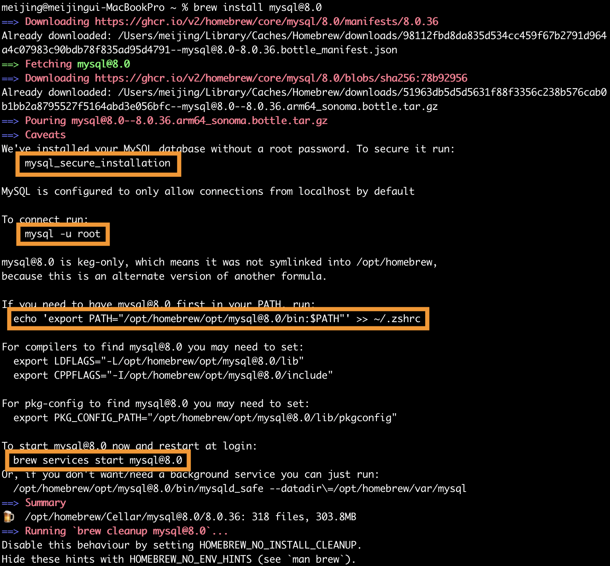

맥북에서 Homebrew를 사용하여 MySQL을 간단하게 설치하였습니다.

## 1. Homebrew 설치
Homebrew가 설치되어 있지 않다면 터미널을 열고 아래 명령어를 실행하여 Homebrew를 설치합니다.
```zsh
$ /bin/bash -c "$(curl -fsSL https://raw.githubusercontent.com/Homebrew/install/HEAD/install.sh)"
```

  
Homebrew를 최신버전으로 업데이트 해줍니다.
```zsh
$ brew update
```

---

## 2. MySQL 명칭&버전 확인
Homebrew가 설치되었다면, 아래 명령르로 mysql 명칭과 버전을 확인해보겠습니다.

```zsh
$ brew search mysql
```


저는 `mysql@8.0`을 설치해보겠습니다.

---

## 3. MySQL 설치

### 3-1. 설치하기
```zsh
$ brew install mysql@8.0
```


### 3-2. 환경변수 설정하기
아래 명령으로 환경변수를 입력합니다.   
(환경변수를 설정하지 않았다면 command not found: mysql 이라는 에러문구가 나올 수 있습니다.)
```zsh
$ echo 'export PATH="/opt/homebrew/opt/mysql@8.0/bin:$PATH"' >> ~/.zshrc
$ source ~/.zshrc
```

### 3-3. 버전 확인하기
제대로 설치가 됐는지 버전 확인을 해줍니다.
```zsh
$ mysql --version
```


### 3-4. 초기 설정하기
```zsh
$ mysql_secure_installation 
```

---

## 4. MySQL 서버 접속
초기 설정에 입력했던 비밀번호를 입력 후 접속합니다.
```zsh
mysql -u root -p
```

---

## 5. MySQL 서버 시작:
다음 명령어로 MySQL 서버를 시작합니다.
```zsh
$ brew services start mysql@8.0
$ mysql.server start
```

---

## 6. MySQL 서버 재시작:
다음 명령어로 MySQL 서버를 재시작합니다.
```zsh
$ brew services restart mysql@8.0
```

---

## 7. MySQL 서버 종료:
다음 명령어로 MySQL 서버를 종료합니다.
```zsh
$ brew services stop mysql@8.0
$ mysql.server stop
```

